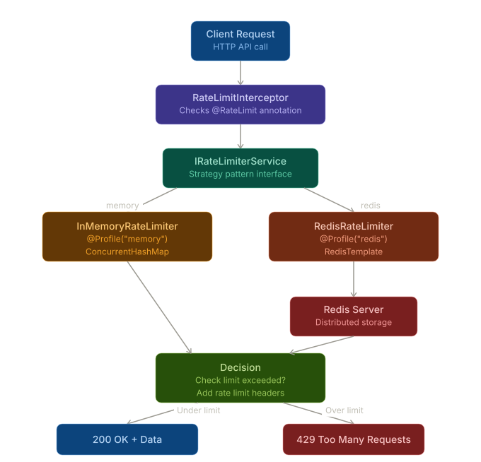

# API Rate Limiter

A flexible, production-ready API rate limiter built with Spring Boot, supporting both in-memory and Redis-backed storage strategies.

## Architecture


## Features

- ✅ Fixed window rate limiting algorithm
- ✅ Per-endpoint custom rate limits via annotations
- ✅ Multiple storage backends (in-memory, Redis)
- ✅ Configurable via Spring profiles
- ✅ Proper HTTP 429 responses with rate limit headers
- ✅ Per-user rate limiting (by IP or custom identifier)
- ✅ High performance (2,298+ req/s)

## Tech Stack

- Java 21
- Spring Boot 3.2.2
- Spring Data Redis
- Maven
- Redis (optional)

## Quick Start

### Prerequisites

- Java 21+
- Maven
- Redis (optional, for distributed rate limiting)

### Installation

1. **Clone the repository**
```bash
git clone https://github.com/yourusername/api-rate-limiter.git
cd api-rate-limiter
```

2. **Choose your storage backend**

Edit `application.properties`:
```properties
# Use Redis (recommended for production)
spring.profiles.active=redis

# OR use in-memory (good for development/testing)
# spring.profiles.active=memory
```

3. **If using Redis, start Redis server**

**Using WSL/Linux:**
```bash
sudo apt update
sudo apt install redis-server
sudo service redis-server start
```

**Using Mac:**
```bash
brew install redis
brew services start redis
```

**Verify Redis is running:**
```bash
redis-cli ping
# Should return: PONG
```

4. **Run the application**
```bash
./mvnw spring-boot:run
```

The API will start on `http://localhost:8080`

## Usage

### Default Endpoints
```bash
# Products endpoint (100 requests/minute)
curl http://localhost:8080/api/products

# Users endpoint (10 requests/minute)
curl http://localhost:8080/api/users

# Public endpoint (uses default limit)
curl http://localhost:8080/api/public
```

### Custom User Identification

By default, rate limiting is per IP address. You can override this with a custom header:
```bash
curl -H "X-User-ID: user123" http://localhost:8080/api/products
```

### Rate Limit Headers

All responses include rate limit information:
```
X-RateLimit-Limit: 100
X-RateLimit-Remaining: 95
X-RateLimit-Reset: 1708750800000
```

### Rate Limit Exceeded Response
```json
HTTP/1.1 429 Too Many Requests
X-RateLimit-Limit: 100
X-RateLimit-Remaining: 0

{
  "error": "Too many requests. Please try again later."
}
```

## Custom Rate Limits

Define custom rate limits per endpoint using the `@RateLimit` annotation:
```java
@RestController
@RequestMapping("/api")
public class ProductController {
    
    @GetMapping("/products")
    @RateLimit(requests = 100, windowMs = 60000) // 100 requests per minute
    public List<String> getProducts() {
        return List.of("Product 1", "Product 2", "Product 3");
    }
    
    @GetMapping("/users")
    @RateLimit(requests = 10, windowMs = 60000) // 10 requests per minute
    public List<String> getUsers() {
        return List.of("User 1", "User 2");
    }
}
```

## Performance Benchmarks

### Test Setup
- **Tool**: Apache Bench (ab)
- **Hardware**:   
  - CPU: AMD Ryzen 7 5800X3D 8-Core Processor (3.98 GHz)
  - RAM: 32.0 GB
- **OS**: Windows with WSL
- **Rate Limit**: 100 requests per minute per IP

### Test 1: Rate Limiter Effectiveness

**Command:**
```bash
ab -n 1000 -c 10 http://localhost:8080/api/products
```

**Results:**
- Total requests attempted: 1,000
- Successful requests (200 OK): 100 ✅
- Rate limited (429): 900 ✅
- Requests per second: 2,298 req/s
- Average response time: 4.35ms
- 95th percentile latency: 3ms

**Conclusion:** Rate limiter correctly blocks requests exceeding 100/min limit while maintaining fast response times.

### Test 2: Multiple Concurrent Users

**Commands:**
```bash
ab -n 100 -c 10 -H "X-User-ID: user1" http://localhost:8080/api/products
ab -n 100 -c 10 -H "X-User-ID: user2" http://localhost:8080/api/products
ab -n 100 -c 10 -H "X-User-ID: user3" http://localhost:8080/api/products
```

**Results:**
- User 1: 100/100 successful ✅
- User 2: 100/100 successful ✅
- User 3: 100/100 successful ✅

**Conclusion:** Each user gets independent rate limits. System correctly isolates rate limiting per identifier.

### Test 3: Different Endpoint Limits

**Commands:**
```bash
# Products endpoint (100/min limit)
ab -n 150 -c 10 http://localhost:8080/api/products

# Users endpoint (10/min limit)
ab -n 20 -c 5 http://localhost:8080/api/users
```

**Results:**
- Products: 100 successful, 50 rate limited ✅
- Users: 10 successful, 10 rate limited ✅

**Conclusion:** Per-endpoint rate limiting works correctly with different limits.

## Architecture

### Storage Strategies

The project uses the Strategy pattern to support multiple storage backends:
```
IRateLimiterService (interface)
├── InMemoryRateLimiterService (@Profile("memory"))
└── RedisRateLimiterService (@Profile("redis"))
```

**In-Memory:**
- Uses `ConcurrentHashMap`
- Fast, simple
- Good for single-instance deployments
- No external dependencies

**Redis:**
- Distributed rate limiting
- Survives application restarts
- Supports multi-instance deployments
- Production-ready

### How It Works

1. **Request arrives** → Interceptor checks for `@RateLimit` annotation
2. **Extract limits** → Uses annotation values or defaults (100 req/min)
3. **Generate key** → Combines user identifier + endpoint path
4. **Check limit** → Queries storage backend (Redis or in-memory)
5. **Allow or block** → Returns 200 OK or 429 Too Many Requests
6. **Add headers** → Includes rate limit information in response

### Algorithm: Fixed Window

- Time is divided into fixed windows (e.g., 1-minute intervals)
- Each window has a counter that starts at 0
- Counter increments with each request
- Counter resets when window expires
- Simple, performant, but can allow bursts at window boundaries

## Configuration

### application.properties
```properties
# Storage backend (memory or redis)
spring.profiles.active=redis

# Redis configuration (only used with redis profile)
spring.data.redis.host=localhost
spring.data.redis.port=6379

# Server configuration
server.port=8080
```

### Default Rate Limits

Configured in `RateLimitInterceptor.java`:
- Default: 100 requests per 60,000ms (1 minute)
- Override per endpoint with `@RateLimit` annotation

## Testing

### Run Unit Tests
```bash
./mvnw test
```

### Manual Testing

**Test rate limiting:**
```bash
# Make 101 requests quickly
for i in {1..101}; do curl http://localhost:8080/api/products; done
```

**Verify Redis storage:**
```bash
redis-cli
KEYS ratelimit:*
GET ratelimit:127.0.0.1:/api/products
```

## Verifying Redis Usage

Check that rate limits are stored in Redis:
```bash
redis-cli

# In Redis CLI:
KEYS ratelimit:*
GET ratelimit:192.168.86.33:/api/products
TTL ratelimit:192.168.86.33:/api/products
```

You should see:
- Keys matching your rate limit entries
- Counter values (1, 2, 3... up to limit)
- TTL showing time until window reset

## Future Enhancements

- [ ] Implement Token Bucket algorithm for smoother rate limiting
- [ ] Add Sliding Window algorithm for more accuracy
- [ ] Support for rate limiting by API key
- [ ] Admin dashboard to view/modify limits
- [ ] Metrics and monitoring integration
- [ ] Distributed rate limiting across multiple Redis instances
- [ ] Rate limit bypass for whitelisted IPs
- [ ] Dynamic rate limit adjustment based on load

